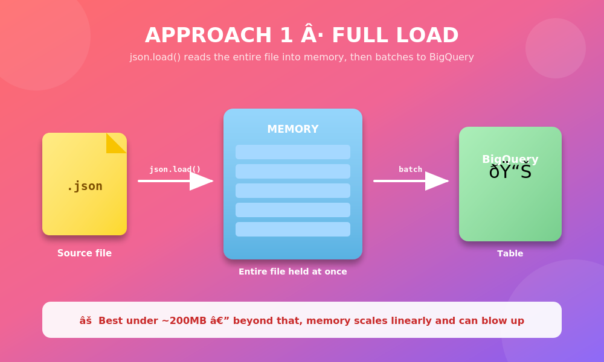
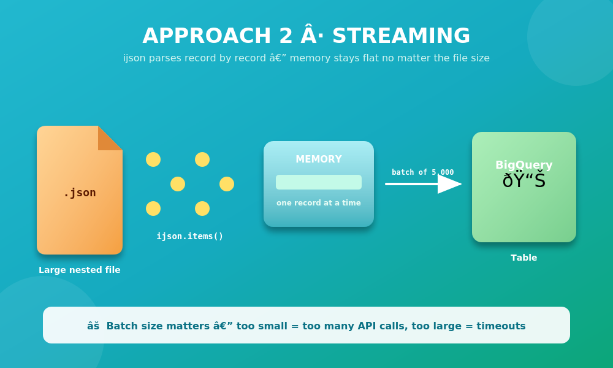
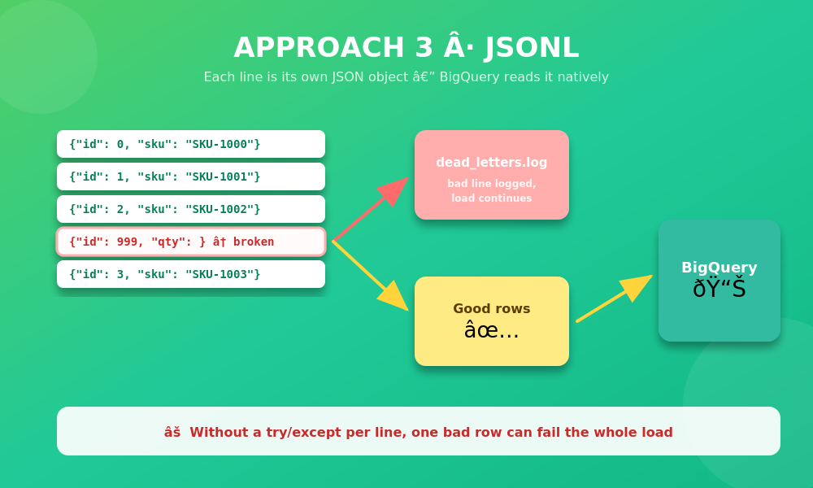

# JSON to BigQuery — 3 Parsing Approaches

Three practical ways to parse JSON source files before loading them into Google BigQuery, depending on file size and structure. Includes working Python scripts, sample data, and diagrams for each approach.





## Why this exists

The "right" way to parse JSON before a BigQuery load depends entirely on the file — not on habit. This repo walks through three real approaches, what breaks with each, and how to handle it.

## Approaches

| # | Approach | Best for | Key risk |
|---|----------|----------|----------|
| 1 | [Full load](src/approach1_small_file.py) — `json.load()` | Files under ~200MB | Memory scales linearly with file size |
| 2 | [Streaming](src/approach2_streaming.py) — `ijson` | Large, deeply nested files (GBs) | Batch size tuning — too small/large both hurt |
| 3 | [JSONL](src/approach3_jsonl.py) — line by line | Newline-delimited sources | One malformed line can silently fail the whole load |

## Getting started

```bash
# clone the repo
git clone https://github.com/<your-username>/json-to-bigquery.git
cd json-to-bigquery

# install dependencies
pip install -r requirements.txt

# generate sample data
python3 src/generate_sample_data.py

# run any approach (dry-run mode by default, no BQ credentials needed)
python3 src/approach1_small_file.py
python3 src/approach2_streaming.py
python3 src/approach3_jsonl.py
```

By default all scripts run in `DRY_RUN = True` mode and print what *would* be loaded to BigQuery. To actually load data, set `DRY_RUN = False` in the script and authenticate with a GCP service account (see below).

## Connecting to real BigQuery

1. Create a GCP service account with `BigQuery Data Editor` role.
2. Download the JSON key and set:
   ```bash
   export GOOGLE_APPLICATION_CREDENTIALS="/path/to/key.json"
   ```
3. Update the `table_id` in each script to your `project.dataset.table`.
4. Set `DRY_RUN = False`.

## Repo structure

```
json-to-bigquery/
├── src/
│   ├── generate_sample_data.py    # creates sample JSON/JSONL files
│   ├── approach1_small_file.py    # full in-memory load
│   ├── approach2_streaming.py     # ijson streaming + batching
│   └── approach3_jsonl.py         # line-by-line + dead-letter handling
├── images/                        # diagrams for each approach (PNG + SVG source)
├── docs/
│   └── video_script.md            # storyboard/voiceover script explaining the repo
├── requirements.txt
├── LICENSE
└── README.md
```

## Key takeaways

- Schema drift is the real recurring headache — a new field in a nested source can quietly break your BigQuery schema mapping.
- Speed vs. memory vs. fault tolerance — pick two, plan for the third.
- Inspect the file before picking a parsing method; don't default out of habit.

## License

MIT — see [LICENSE](LICENSE).
